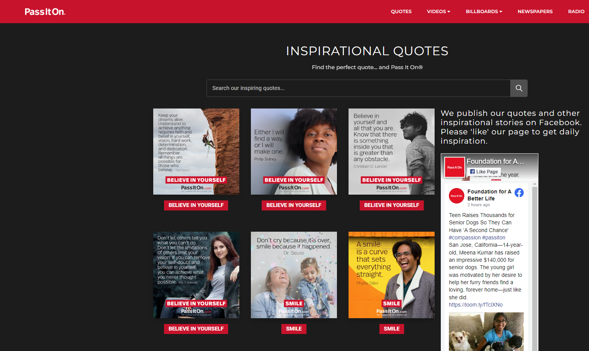
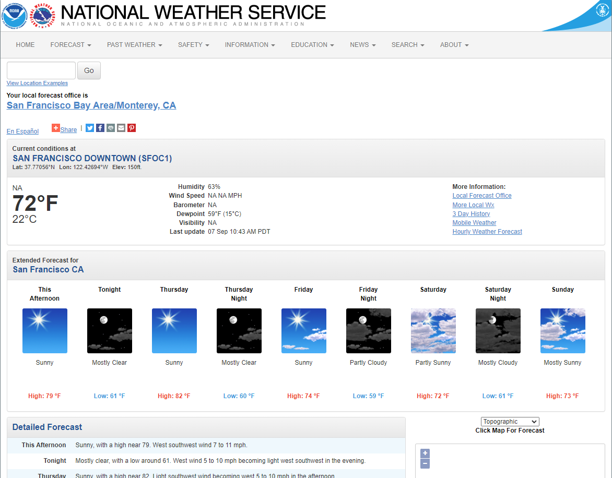

# Web Scraping using Beautiful Soup
Scraping data from two websites using Beautiful Soup and storing them in csv files.

## Website 1
Scraping the theme (category), image link, quotes, quotes-url.

## Website 2
Scraping the 7 day data for San Francisco. Saving the day, desc, high/low (temperature), short description, temperature.

